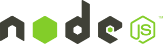

# Mein Angebot

  
  
  
  
  
  

Meine Passion ist die Entwicklung von Webanwendungen mit vorzugsweise mit [JavaScript](https://developer.mozilla.org/de/docs/Web/JavaScript) und der Technologie [Node.js](http://nodejs.org). Aber auch [PHP](http://php.net/) und [.NET](https://www.microsoft.com/net) liegen in meinem Repertoire. Ich suche immer die Herausforderung und freue mich, Ihre komplexen Aufgaben zu lösen.

## Freelancer

Als Freelancer biete ich gerne  individuelle Softwarelösungen für Ihr Unternehmen an. Meine Kernkompetenz ist die Web-Entwicklung: von der Datenbankanbindung über die Business-Logik bis hin zu interaktiven Webseiten (Stichwort [Full-Stack-Developer](http://www.laurencegellert.com/2012/08/what-is-a-full-stack-developer/)).

Am besten lassen sich Projekte persönlich besprechen; im AXIS Coworking Loft in der Tabakfabrik Linz oder gerne auch an einem Ort Ihrer Wahl. [Kontaktieren](../contact)
